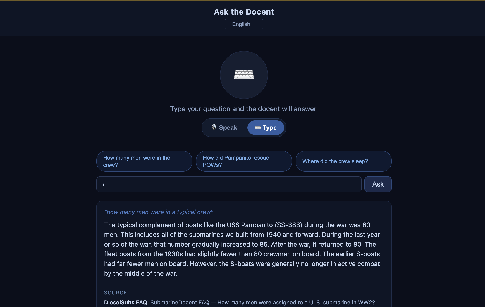

# SubmarineDocent

**[submarinedocent.org](https://submarinedocent.org)** answers questions about
the United States submarine force in the Second World War — the boats, the men
who took them out, and the Pacific campaign they fought. Ask it something in
your own words and it finds the answer in a curated corpus of FAQs, glossary
entries, wartime Navy manuals and lost-boat records. It is an independent
educational project, not affiliated with any museum or naval institution, and
it is built as a FastAPI backend serving static pages. It is built with Claude
Code as a pair programmer; every change is reviewed and approved by a human.



## Quick start

You need Python 3.9 or newer. Nothing else — no database, no vector store, no
API key.

```bash
git clone https://github.com/igreisman/submarinedocent.git
cd submarinedocent

python3 -m venv .venv
source .venv/bin/activate          # Windows: .venv\Scripts\activate
pip install -r requirements.txt

cp .env.example .env.local
SAMPLE_CONTENT_MODE=true uvicorn api.main:app --port 8000
```

Open <http://localhost:8000/web/askthedocent.html>.

`SAMPLE_CONTENT_MODE=true` runs against `sample_data/corpora/`, which is a
deliberately tiny redistribution-safe dataset — a handful of records, not the
real corpus. It is there to prove the machinery works, so **ask it one of the
questions it actually holds**:

> What is a fleet submarine?
> How many men served on a WWII fleet boat?

Anything else gets *"I don't have that detail in the reference material I'm
using"*, which is the system working correctly: it declines rather than
inventing. Drop `SAMPLE_CONTENT_MODE` to run against the full corpus in
`corpora/` and it will answer far more.

Admin tools stay off unless you set credentials — see
[Admin access](#admin-access).

## How it answers

Retrieval is **BM25 with IDF over JSONL files** — plain lexical search, no
embeddings, no vector store, and no language model in the default
configuration. Four corpora are searched at once and weighted so that the
answers written for this project outrank the reference material: the FAQ
corpus at 1.2, short answers at 0.8, and the two 1946 Navy publications at 0.5,
because primary sources should fill gaps rather than displace a written answer.
**The FAQ corpus is the source of truth** — when an answer is wrong, the fix is
almost always a corpus record, not a code change.

Answers are extracted from the retrieved records rather than generated. Setting
`USE_LLM=true` switches to synthesis, but the deployed site does not use it.

## Contributing a correction

Corrections to the answers are the contribution this project most wants, and
they need no Python.

1. Find the wrong record. Every corpus is one JSON object per line in
   `corpora/`; the FAQ corpus is `corpora/dieselsubs_faq_corpus.jsonl`.
2. Edit the `text` field, or add a new record.
3. **Cite a source.** A correction without one cannot be reviewed, and will not
   be merged. Published books, Navy documents and official histories carry
   weight; forum posts and undated web pages do not.
4. Open a pull request describing what was wrong and how you know.

[CONTRIBUTING.md](CONTRIBUTING.md) covers record shape, what a good citation
looks like, and why drafts are not answerable until they are reviewed.

## Reporting a wrong answer

If you would rather not open a pull request, just tell us the answer was wrong.

- **On the site** — the "no answer found" flow on Ask the Docent sends the
  question straight to the maintainer.
- **On GitHub** — open an issue with the question you asked, the answer you
  got, and what it should have said.
- **By email** — dieselsubs1945@gmail.com.

A wrong answer is useful information. It usually means a record is missing, not
that retrieval is broken, and the question you asked is the evidence for what
to write next.

## Licensing

Code and content are licensed separately, and the split is deliberate.

| What | Licence |
|---|---|
| Source code | MIT — [LICENSE](LICENSE) |
| Text written for this project | CC BY 4.0 — [LICENSE-CONTENT](LICENSE-CONTENT) |
| The glossary | Dwight Naset's work, CC BY 4.0 — released by him 18 September 2026, credit him by name |
| The 1946 Navy publications and Medal of Honor citations | Public domain, US federal government works |
| Photographs | **Not granted.** Mixed provenance, used with credit |
| Video | **Not granted.** None is distributed here |

[corpora/README.md](corpora/README.md) states the origin and licensing of every
corpus file and is the authority where these files disagree.
[NOTICE](NOTICE) is the short version.

Cloning this repository does not give you rights in the photographs, in the
glossary, or in any video the catalogue links to.

---

# Reference

## Stack

Python 3.9+, FastAPI and Uvicorn, a static HTML/CSS/JavaScript frontend, and
JSONL corpora on disk. Transcription and email delivery are optional
third-party services; without them the features degrade rather than fail.

## Project layout

- `api/` — the FastAPI application. `api/main.py` holds the routes, retrieval and auth middleware.
- `web/` — frontend pages, each a self-contained HTML file. `web/edit_*.html` are admin pages.
- `corpora/` — the JSONL corpora. See [corpora/README.md](corpora/README.md).
- `sample_data/corpora/` — the redistribution-safe sample dataset used by sample mode.
- `scripts/` — maintenance and verification utilities.
- `bin/` — one-off import and sync tools, not part of the running app.
- `_test/` — retrieval evaluation scripts. See Tests below.
- `docs/` — [architecture.md](docs/architecture.md).
- `.github/workflows/` — CI.

## Running against your own content

`SAMPLE_CONTENT_MODE=true` uses `sample_data/corpora/`. `CONTENT_ROOT` points
the app at any directory of corpora you like. If `CONTENT_ROOT` is unset and
the full corpus bundle is missing, the app falls back to `sample_data/corpora/`
automatically and says so in `/health`.

`/health` reports which corpus directory is in use, whether sample mode is
active, whether it was reached by fallback, how many chunks each corpus holds,
and whether server transcription and TTS are available.

## Content rights

The project is built to host material from several museums. That material is
licensed to the project by the institution holding it, not owned outright:
permission can be given for one use, limited in time, or withdrawn on a phone
call, and it differs per asset.

With one museum that is a conversation you keep in your head. Across twenty it
has to be data, so every third-party asset carries:

| field | meaning |
| --- | --- |
| `museum_id` | joins `corpora/museums.jsonl` |
| `rights_status` | `granted`, `pending`, or `withheld` |
| `rights_note` | the basis in words — who agreed, when, on what terms |
| `rights_expires` | ISO date after which permission lapses (optional) |

One gate, `_rights_cleared()`, decides whether an asset may be served. Anything
not cleared is simply absent, and the surrounding answer renders unchanged,
because answer text is written to stand on its own. Admin endpoints read raw
records instead, so a curator can still see and fix an asset the public pages
are withholding.

`GET /admin/rights` lists every third-party asset with its owner, status and
reason, including ones being withheld and therefore invisible everywhere else.

**`RIGHTS_STRICT`** — records predating these fields carry no status, so by
default an unrecorded asset is still served. Once every asset has been
reviewed, set `RIGHTS_STRICT=true` and unrecorded means not cleared. Check
`GET /admin/rights` first: anything still unrecorded disappears from the public
site the moment you do.

## Tests and CI

There is no unit test suite. Two kinds of checking exist instead.

**CI** ([.github/workflows/sample-content-smoke.yml](.github/workflows/sample-content-smoke.yml))
runs on every push and pull request. It boots the app in sample mode and
asserts that `/health`, `/api/faqs`, `/api/incidents` and `/api/eternal-patrol`
respond, and that `/admin/faqs` and `/feedback/list` return `503` while
credentials are unset. It does not run anything in `_test/`.

**Retrieval evaluation** lives in `_test/`. These are scripts, not tests: they
POST questions to a *running* server at `https://localhost:8443` and report
whether the expected corpus entry came back. They need the full corpora, so
they are meaningful only against a real local instance — not in sample mode and
not in CI.

```bash
./start_https.sh                        # one shell
.venv/bin/python _test/spot_check.py    # another
```

`spot_check.py` prints a per-question PASS/FAIL and a total. `test_batch*.py`
and their `*_eval.py` counterparts run larger question sets. Treat the totals
as a regression signal when changing retrieval — the constants under Retrieval
tuning were set against them.

**Gate comparison.** `scripts/compare_gate.py` measures what
`INCLUDE_GENERATED_FAQS` changes, by running every FAQ title and a set of
golden questions through retrieval twice. It refuses to run unless the corpus
and gate it is measuring match what a live deployment actually serves, because
a comparison against the wrong corpus reads as a prediction and is not one.

```bash
.venv/bin/python scripts/compare_gate.py --no-preflight   # local, unverified
```

## Environment variables

See [.env.example](.env.example) for defaults.

### Service credentials

- `GROQ_API_KEY` — enables server-side Whisper transcription at `/transcribe`. Without it `/health` reports `transcribe_available: false` and voice input falls back to the browser's own speech recognition, or to typing.
- `OPENAI_API_KEY` — enables spoken answers at `/tts`. Without it `/health` reports `tts_available: false`.
- `OPENAI_TTS_MODEL`, `OPENAI_TTS_VOICE` — optional overrides. Default `gpt-4o-mini-tts` and `alloy`.
- `SMTP_HOST`, `SMTP_PORT`, `SMTP_USER`, `SMTP_PASS` — email delivery.
- `HISTORIAN_EMAIL` — where visitor questions from the "no answer found" flow are sent. There is no default; unset, the flow records the question and sends nothing.

### Route protection

- `ADMIN_USERNAME`, `ADMIN_PASSWORD` — required to enable `/admin/*`, `/feedback/list` and admin-facing pages. No default; there is no built-in password.
- `MUSEUM_ADMIN_USERNAME`, `MUSEUM_ADMIN_PASSWORD` — a second, narrower pair opening only `/admin/museum_pages*` and `/web/edit_museum_pages.html`, for a curator who should not hold the full admin password.
- `ADMIN_AUTH_FAIL_LIMIT` (5), `ADMIN_AUTH_FAIL_WINDOW_SECONDS` (900), `ADMIN_AUTH_GLOBAL_LIMIT` (50) — failed-authentication throttling, per address and in total.
- `CLIENT_IP_HEADER`, `TRUSTED_PROXY_HOPS` (1) — how the client address is determined behind a proxy. The throttle keys on the address the trusted proxy adds, never on the leftmost `X-Forwarded-For` value, which the client controls.

If neither pair is set, the routes each protects return `503` rather than a
login prompt: the surface is off, not merely locked. Credentials are compared
with `secrets.compare_digest`.

### Answer behaviour

- `USE_LLM` — when true, answers are synthesized rather than extracted. Off by default.
- `INCLUDE_GENERATED_FAQS` — when `1`, generated drafts can answer. Off by default, so only reviewed `faq_`/`fix_` records reach a visitor.
- `RIGHTS_STRICT` — see Content rights.

### Retrieval tuning

Scoring constants, overridable without a code change. Defaults in parentheses,
chosen against the evaluation scripts in `_test/`; changing them shifts which
source answers a question.

- `BM25_B` (0.3) — length normalisation. Low on purpose: chunk length here reflects the kind of content, not verbosity.
- `EXACT_TITLE_BOOST` (20.0) — multiplier when a query matches an FAQ title outright.
- `FLEETSUB_MANUAL_WEIGHT` (0.5) — weight of the Fleet Type Submarine manuals.
- `SUB_LOSSES_WEIGHT` (0.5) — weight of the 1946 submarine losses report.

### Host and redirect config

- `LEGACY_DOMAIN_HOSTS`, `LEGACY_DOMAIN_TARGET` — legacy hostnames to redirect, and where to.
- `DEFAULT_ROOT_REDIRECT` — first-visit landing page.
- `RETURNING_VISITOR_REDIRECT` — landing page when the `visited` cookie is present.

### Content source

- `SAMPLE_CONTENT_MODE`, `CONTENT_ROOT` — see Running against your own content.

### Local HTTPS helper

Read by [start_https.sh](start_https.sh) only.

- `LOCAL_HTTPS_HOST`, `LOCAL_HTTPS_PORT` — host and port shown in the banner, and the port uvicorn binds.
- `LOCAL_STATIC_PORT` — legacy separate static server; the script only kills anything still listening there.
- `SSL_KEYFILE`, `SSL_CERTFILE` — TLS material, defaulting to `certs/key.pem` and `certs/cert.pem`.

## Admin access

Admin pages and endpoints use server-side Basic Auth applied in middleware
rather than per-route, so a new `/admin/` route or `web/edit_*.html` page is
covered the moment it exists.

Requires `ADMIN_USERNAME` and `ADMIN_PASSWORD`: `/admin/*`, `/feedback/list`,
`/feedback.html`, `/review.html`, `/faq_editor.html`, `/edit.html`,
`/web/edit_*.html`.

Requires either that pair or `MUSEUM_ADMIN_USERNAME` and
`MUSEUM_ADMIN_PASSWORD`: `/admin/museum_pages*`,
`/web/edit_museum_pages.html`.

With no credentials configured these return `503`, not `401` — the surface is
off, not merely locked, so an unconfigured deployment cannot be brute-forced.
CI asserts this on every push. Failed authentications are throttled per address
and in total; see Route protection above.

## Deployment notes

The site runs on Render, configured in the dashboard rather than by a blueprint
in this repository. The `render.yaml` blueprint was removed in July 2026
because it recreated a duplicate service on sync; service settings, environment
variables and the persistent disk are managed in the dashboard. Redeploy on
push is handled by Render's own GitHub integration.

Editable corpora live on a persistent disk at `/data`, seeded from `corpora/`
on first boot, so curator edits survive a redeploy. Locally there is no such
disk and everything resolves to `corpora/`.

For local HTTPS, [start_https.sh](start_https.sh) expects a TLS key and
certificate at `certs/key.pem` and `certs/cert.pem`. `certs/` is not tracked;
generate your own.

## Documentation

- [docs/architecture.md](docs/architecture.md) — corpora, the retrieval path, the admin tool, the review gate.
- [corpora/README.md](corpora/README.md) — what each corpus is and who owns it.
- [CONTRIBUTING.md](CONTRIBUTING.md) — the correction workflow.
- [SECURITY.md](SECURITY.md) — reporting a vulnerability.
- [CODE_OF_CONDUCT.md](CODE_OF_CONDUCT.md) — community expectations.
